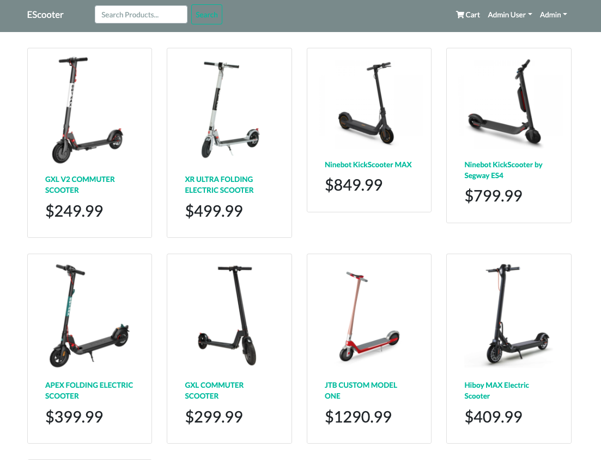
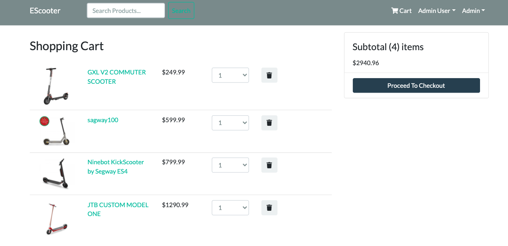
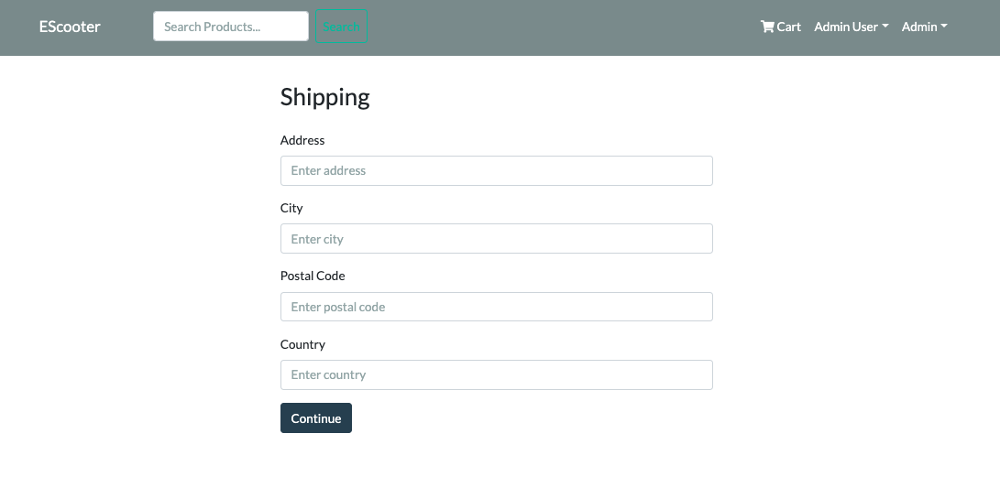
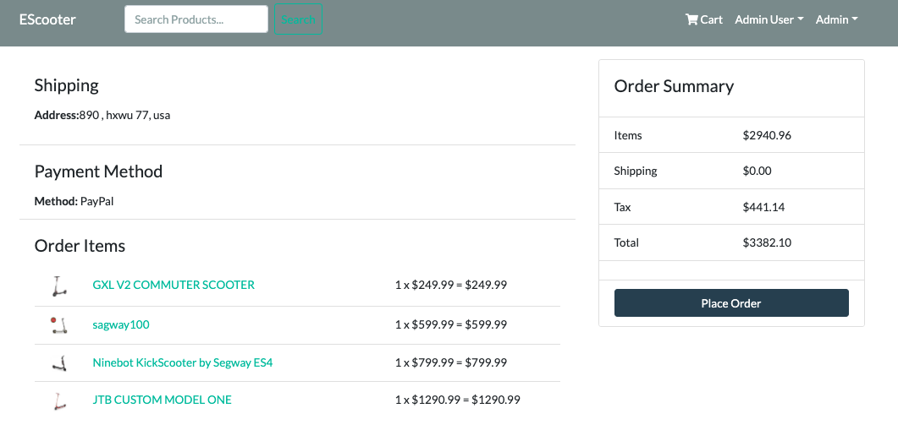

# ESCOOTER

## Descriptions
EScooter is a full stack CRUD application built with Mern Stack and React-redux as a front-end frameworks. This application contains the ability to allow customers to shop online for Electric Scooters.

## Home Page

## Shopping Cart

## SHipping

## PlaceOrder

## Technologies

* Mern Stack
  * Mongo
  * Express
  * React
  * Node.js
  * Redux

* Create-react-app

## Features
* Include:
  * Login/ Register
  * Product search
  * View Products
  * Shopping Cart Functionality
  * Checkout process (shipping, payment method)
  * Administrative privileges include adding inventory
    * Update, Delete, and Add Inventory (through form or seed)
  *  Database seeder (products & users)

### Front-End Link
Coming Soon....

### Back-End Link

Coming Soon....

* Git Hub back-End
  * https://github.com/sanaser58/Escooters-backend

#### Link to Wireframe

 * https://www.gomockingbird.com/projects/0gdxbdp/4gXVnC
